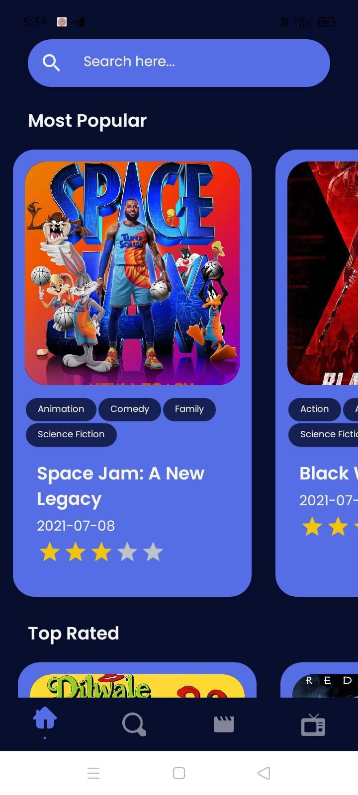
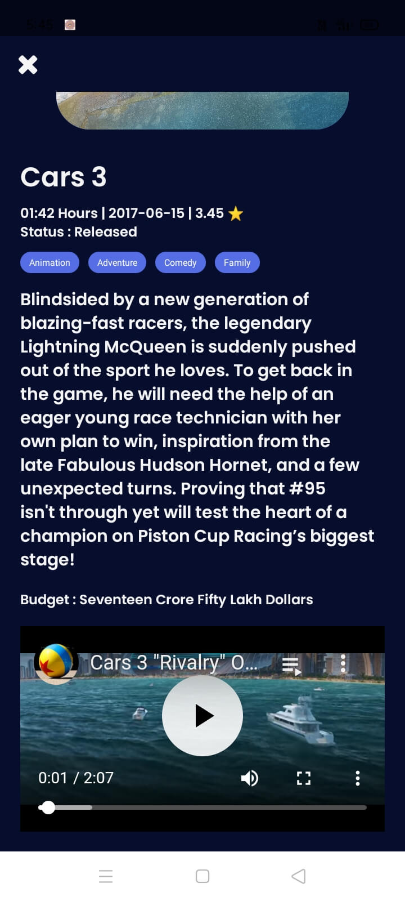
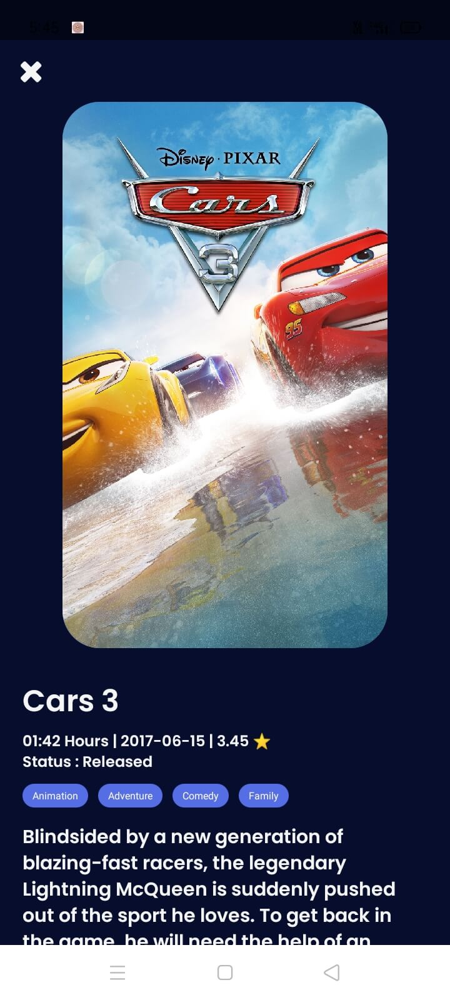
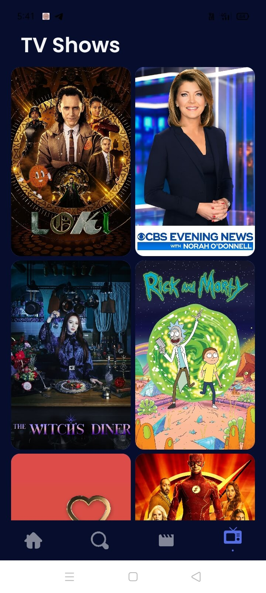
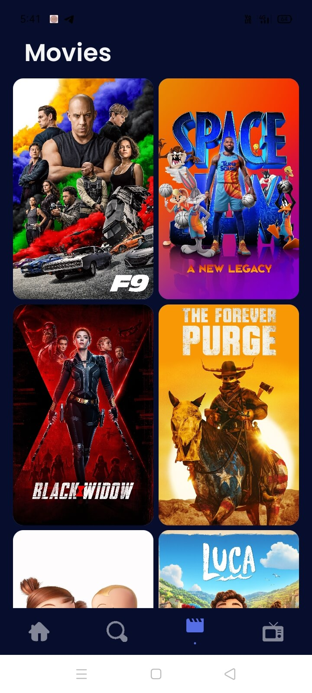
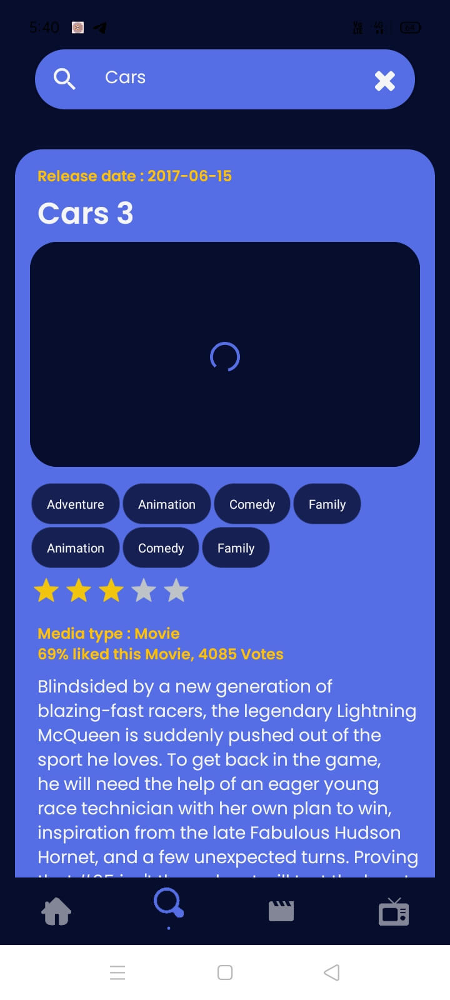

<!-- PROJECT LOGO -->
 

  

  <h3 align="center">Movieflix with React Native</h3>

  

    An awesome Movies and TV Shows android app made with React Native!
     
    <a href="https://github.com/Muhammed-Rahif/Movieflix/">Github Link</a>
    ·
    <a href="https://github.com/Muhammed-Rahif/Movieflix/issues/">Report Bug</a>
    ·
    <a href="https://github.com/Muhammed-Rahif/Movieflix/pulls/">Send a Pull Request</a>
  

---

## 📱️ Screenshots 

  
  
  
  
  
  

## ⛏️ Built Using 

- [TMDB](https://www.themoviedb.org/) - The Movie Database (TMDb) is a popular, user editable database for movies and TV shows.
- [React Native](https://reactnative.dev/) - React Native is a JavaScript framework for building cross platform softwares
- [React Native Paper](https://reactnativepaper.com/) - Collection of customizable and production-ready components for React Native, following Google's Material Design guidelines.
- [Expo](https://expo.dev/) - Expo is an open-source platform for making universal native apps for Android, iOS, and the web with JavaScript and React.

## ✍️ Authors 

- [@Muhammed-Rahif](https://github.com/Muhammed-Rahif) - Idea & Full work

<!-- ## 🎉 Acknowledgements 

- Hat tip to anyone whose code was used
- Inspiration
- References -->
